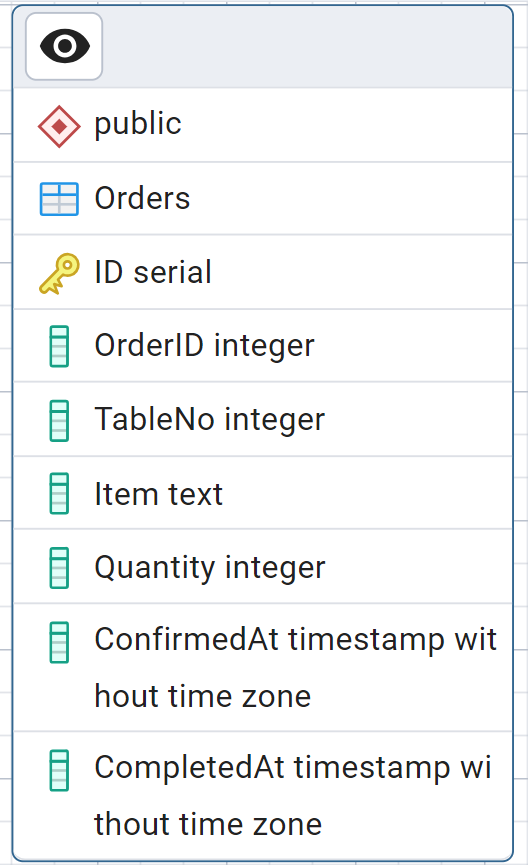

# Part A - Quick Fixes

## Q1

List three essential features Bistro 92’s system needs for customer satisfaction and efficient order processing:

- **Real-time Order Updates**: Instant communication between the table device, kitchen, and admin dashboard. This involves the use of a database and wireless communication.

- **Error-Free Customization and Cancellation**: Easily customize orders (e.g., extra cheese, no onions) and allow customers to cancel within a time frame to correct mistakes.

- **Feedback**: Clear "Order Received" messages, and updates on order cancellation, readiness for delivery, and delivery status.

---

## Q2

Describe two design principles to make the smart pad interface intuitive for all users, including tech novices:

- **Minimalist Interface**: Use simple menus, large fonts, clear icons, and minimal text. Choose accessible color schemes for visually impaired users.

- **Consistent Navigation**: Buttons should consistently behave the same way (e.g., Button 3 always scrolls down) and have clear, engraved labels.

---

## Q3

Identify three potential security vulnerabilities and one solution for each:

- **Theft of Device**:  
  _Solution_: Attach a tamper alarm or physically secure devices to tables.

- **Order Tampering (Fake Orders)**:  
  _Solution_: Require a table-specific passcode or QR verification before final order submission. Devices should only work at their assigned table.

- **Cloud Data Breach**:  
  _Solution_: Use HTTPS encryption between ESP32 devices and cloud servers and store minimal customer data.

---

## Q4

Explain two strategies to keep Bistro 92’s system responsive and stable during peak hours:

- **Local Caching**: Store orders locally if the internet is slow and sync them once the connection stabilizes.

- **Load Balancing on Cloud Server**: Distribute incoming order requests across multiple servers to avoid overload.

---

## Q5

Describe one method to integrate the existing inventory system with Bistro 92’s new system without disrupting operations:

- **Use an API Bridge**: Create an intermediary program that pulls data from the inventory system and updates the smart pad system without directly modifying either side. This ensures both systems work independently and minimizes downtime. Continuous updates on processed, delivered, and pending items will be reflected in the database and dashboard.


---


# Part B - Tech Tricks

## Q1

Design a database schema for Bistro 92 to track users, orders,
menu items, tables, and payments, optimized for fast queries:
- **Database Schema**  

  
- **SQL Query**  

```sql
CREATE TABLE public."Orders"
(
	"ID" SERIAL PRIMARY KEY,
    "OrderID" INTEGER NOT NULL,
    "TableNo" INTEGER NOT NULL,
    "Item" TEXT NOT NULL,
    "Quantity" INTEGER NOT NULL,
    "ConfirmedAt" TIMESTAMP,
    "CompletedAt" TIMESTAMP
);

ALTER TABLE IF EXISTS public."Orders"
    OWNER TO postgres;
```  
[Bistro 92 Database File](./Bistro%2092%20Orders.sql)


  
## Q2

Write an SQL query to retrieve all orders from the last hour,
including table number, items ordered, and order time, optimized for speed:
 
- **SQL Query**  

```sql
SELECT *
FROM public."Orders"
WHERE "ConfirmedAt" >= (
    SELECT MAX("ConfirmedAt")
    FROM public."Orders"
) - INTERVAL '1 hour';
```


## Q3
 Implement a feature to notify kitchen staff in real-time when a
new order is placed, and describe your tech stack:
 
- **Implemented in Dashboard**  

There is a chart in our dashboard which only keeps track of currently processing orders. It gets updated once the order is delivered successfully. Thus, staff can easily see the orders which they need to process and prepare real-time.


## Q4
Describe a cloud-based system architecture for real-time
updates, data storage, and smart pad communication, ensuring low latency and
high availability:
 
- **Google Sheets**  

Google Sheets offers extreme simplicity and zero initial infrastructure cost, making it accessible for prototyping or very small-scale use. Its familiar interface allows easy manual data viewing, editing, and basic visualization. Built-in collaboration features simplify sharing status. Google Apps Script enables some basic automation for handling incoming data or simple triggers, provided the volume and real-time requirements are very low. It requires minimal setup compared to dedicated cloud architecture.


## Q5
Design a real-time dashboard showing pending orders, average
fulfillment time, and total sales, specifying tools and justifying your choices:
 
- **Power BI Dashboard**  

[Bistro 92 Dashboard](./Bistro%2092%20Dashboard.pbix)  
- **Preview**  

 


# Part C - Bonus Boosters

## Q1

## Overview
This API is designed for **order placement** in a restaurant system, handling **high concurrency** without errors. The API allows users to create, retrieve, update, and delete orders while ensuring data consistency and preventing over-ordering through stock reservation.

The API includes **rate limiting** to protect against abuse and supports **asynchronous stock validation** to handle multiple requests simultaneously.

---

## Endpoints

### 1. POST /orders
Creates a new order and performs concurrency control to ensure that the items ordered are available in stock before confirming the order.

```json
  {
      "table_no": 1,
      "items": [
          {"item_id": 1, "quantity": 2},
          {"item_id": 2, "quantity": 1}
      ],
      "total_price": 25.50
  }
```
### Success Response

When an order is successfully placed, the API will return the following response:

```json
{
    "order_id": 1,
    "status": "Order placed successfully",
    "order_time": "2025-04-27T15:01:15.625Z"
}
```

### Error Response

If the stock for an item is insufficient, the API will return the following error response:

```json
{
    "error": "Not enough stock for item Burger"
}
```

### 2. GET /orders/{order_id}

Retrieves the details of a specific order by order_id.

### Request:
- **URL**: http://localhost:3000/orders/{order_id}
- **Method**: GET
### Response (Success):

If the order exists, the API will return the following response:

```json
{
    "order_id": 1,
    "table_no": 1,
    "items": [
        {"item_id": 1, "quantity": 2},
        {"item_id": 2, "quantity": 1}
    ],
    "total_price": 25.50,
    "order_time": "2025-04-27T10:00:00",
    "status": "Pending"
}
```

### Response (Error):

If the order does not exist, the API will return the following error response:

```json
{
    "error": "Order not found"
}
```

### 3. PUT /orders/{order_id}

Updates an existing order, allowing modification of items, prices, or status. It also ensures that the requested items are still in stock before applying the changes.

### Request Body (JSON):

The request body should contain the updated items, total price, and order status. Here's an example:

```json
{
    "items": [
        {"item_id": 1, "quantity": 3}
    ],
    "total_price": 30.00,
    "status": "Completed"
}
```
### Response (Success):

If the order is updated successfully, the API will return the following response:

```json
{
    "order_id": 1,
    "status": "Order updated successfully",
    "order_time": "2025-04-27T15:03:02.726Z"
}
```
### Response (Error):

If there is not enough stock for an item, the API will return the following error response:

```json
{
    "error": "Not enough stock for item Burger"
}
```

## How to Run the API

### 1. Install Dependencies

After cloning or creating your project directory, run the following command to install the required dependencies:

```bash
npm install express express-rate-limit
```

### 2. Start the server
Run the following command to start the server
```bash
Copy
Edit
node server.js
```
Access the API: The server will run on http://localhost:3000. Use Postman or any HTTP client to interact with the API.
# Conclusion

This API supports order placement while handling high concurrency using stock reservation and optimistic concurrency control. It also ensures protection against abuse with rate limiting. By using asynchronous stock validation, we can ensure data integrity without blocking the system, making it more responsive under load.


## Q2

Enhance your API to support extreme scalability, processing
numerous simultaneous orders without data loss, and explain your strategies:   

### Database Optimization

- **Indexing**: Used to optimize order values, improving query performance for order-related operations.

- **Partitioning**: Partitioning is done in order to separate the orders by months of order. It’s done in order to process data more efficiently.  

SQL
```sql
CREATE TABLE orders (
    order_id serial PRIMARY KEY,
    table_no INT,
    item_id INT,
    quantity INT,
    order_time TIMESTAMP,
    total_price DECIMAL
) PARTITION BY RANGE (order_time);

-- Create partitions for different months
CREATE TABLE orders_jan_2025 PARTITION OF orders FOR VALUES FROM ('2025-01-01') TO ('2025-02-01');

```


### Horizontal Scaling
- AWS elastic load balancing we can configure our application.
- Auto scaling is done to automatically add more servers when the load increases
- ELB Will route traffic to available instances

### Distributed Caching
- Caching helps to reduce the load on the database and improves the responsiveness of the system.
- Ensure that the cache is updated when stock levels, order status, or other dynamic data changes.   

Code
```javascript
const redis = require('redis');
const client = redis.createClient();

// Cache order details
client.setex('order_123', 3600, JSON.stringify(orderData));
```


### Rate Limiting

Rate limiting protects APIs from overload by restricting request volumes, ensuring stability and fairness. Use Redis for granular controls (IP/user tokens) and API gateways (AWS, Kong) for global request-per-second limits.  

Terminal
```
npm install express-rate-limit
```

server.js
``` javascript
const rateLimit = require('express-rate-limit');

const limiter = rateLimit({
    windowMs: 60 * 1000, // 1 minute
    max: 100, // Limit each IP to 100 requests per windowMs
    message: "Too many requests, please try again later."
});

app.use(limiter);
```

### Asynchronous Processing
Use message queues (RabbitMQ, Kafka, AWS SQS) to decouple order processing—API enqueues orders while workers handle them asynchronously. Deploy scalable worker pools (microservices/background workers) to process queue tasks independently. This keeps the API responsive and allows horizontal scaling for heavy workloads.  

``` javascript
amqp.connect('amqp://localhost', (err, connection) => {
    connection.createChannel((err, channel) => {
        const queue = 'order_queue';
        const msg = JSON.stringify(orderData);
        channel.assertQueue(queue, { durable: true });
        channel.sendToQueue(queue, Buffer.from(msg), { persistent: true });
    });
});

```
# Part D - Interactive Nutrition and Allergen Information with Personalized Suggestion

## Case

Many customers in the society prefer a healthy diet. With days passing, people are becoming more conscious about their health, and many are considering healthy choices. Adding to that, there are people with health issues who also want to have a good time with their friends and family at the restaurants. But what stops them is their constant doubt about whether the food will be according to their health requirements or will suit their gut. Which sometimes becomes really important because, unknowingly, sometimes they order something that will not really be okay according to their taste or their respective health condition.

## Solution: Interactive nutritional and allergen information with personalised suggestions.

The essential features of this system are:


Essential features:

1. **Nutritional Facts Chart**: On tapping a food item, a dropdown menu will appear that will tell the customer the nutritional values of the food items. People with a preference to a specific food nutrient item can also select the category option of that nutrient and prioritize their needs.
2. **Allergen Information**: The dishes will be mentioned with their allergen information, specifying if the dish contains common allergens.
3. **Personalized Menu**: For every customer, we can study their choices. Suppose a customer loves seafood pizza, but she is allergic to shrimp and hence always complains about the presence of shrimp. In those cases, we can always create a profile of the customer to study their choices. When they come again to the restaurant, we can let them know that we remember their choice, and that will increase customer retention and customer interaction with us. Finally, after studying the customer needs for quite some time, we can create a personalized menu that will constantly update according to the customer behavior and their preferences. We can integrate the use of machine learning here.
4. **Real-Time Updates and Customization**: In any case, if the restaurant updates their food or adds new food, upon declaring the nutrients of the food, the food will be categorized in the segments that were created before. Allergen, non-allergen, mildly allergic to some customers, etc. can be the categories.
5. **Dietary Preferences**: When the customer first enters the menu, the system can ask for the choices of preference—vegan, non-vegan, okay with both, etc. If any customer wants to skip this, we can also keep the general method for them as well.
6. **Feedback System**: Upon finishing the dining, the system can ask for the reviews of the customer and about the dining experience. This will constantly evolve the system.

---

## Technology

There is a nutritional information API called Nutritionix, which will help us fetch the real-time data with very detailed nutrition and allergen information.

## Method

- The pad will send request to the API
- The data will be dispatched from the API in an understandable format  

---

For the frontend interface, we can use React. This will make the frontend of the system very user interactive. The pad will be connected to a cloud-based system, which will make sure that the real-time information and updated menu are displayed on the pad.

## Benefits

- **Improved Customer Experience**: Customer satisfaction will be much elevated when this technology is used.
- **Customer Retention**: When the customers feel that Bistro 92 knows their preferences and their choices, they will come back again.
- **Minimized Risk of Allergic Reaction**: Many a time customers face instant allergic reactions due to the presence of allergenic items. It nullifies the total outing for them and also creates negative remarks about the restaurant among others.
- **Healthy Dining**: Customers will not experience any health hazards due to the wrong choice of foods, which increases reliability.
- **Branding**: Bistro 92 will have a good reputation in the food segment and can attract more customers for its dependability.
- 


# Hardware_Video
Link: https://drive.google.com/file/d/18Ir_yfcNWj_jNOtFZIBdaUhyzWMLukE9/view?usp=sharing
### As we have used the 'Wokwi' online platform as suggested by the organizers, we could not transmit the data to the cloud as the wokwi platform does not let users transmit data directly. Hence the WEB id is kept as a pseudo one. The data in the databases were assumed through probable calculations. If the same code and the project is uploaded to a phsyical ESP32 module it will perfectly work and be able to transmit data to google sheets. From there the operator will be able to use the data directly to databases and perform the necessary analysis.
